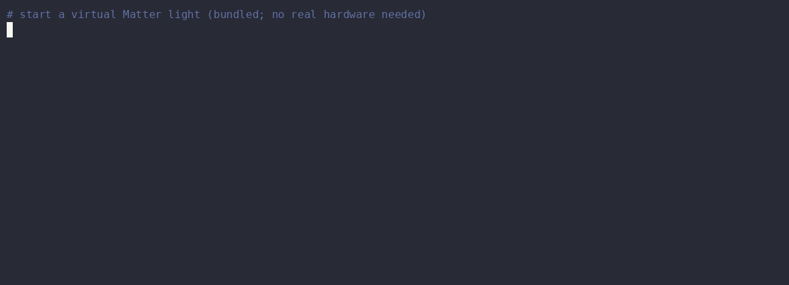

# mat

[](https://github.com/nogu3/mat/actions/workflows/ci.yml)
[](https://crates.io/crates/matterctl)
[](https://nogu3.github.io/mat/)
[](./LICENSE)

**Control your Matter smart home from the command line — pure Rust, pure
JSON.**

`mat` is a command-line Matter controller built for scripts and AI agents,
not apps. It speaks Matter directly — TLV, CASE, the Interaction Model,
groupcast, mDNS discovery, and commissioning are implemented from scratch in
Rust and run in-process — and prints exactly one JSON object per command on
stdout.



The demo runs against `matv`, the virtual Matter device that ships in this
workspace — the whole Quickstart works with no hardware at all.

For the design background, the `mat` / `matd` split, and what `mat` does and
does not do, see [ARCHITECTURE.md](./ARCHITECTURE.md).

## Why mat

Most ways to script Matter go through a hub, a cloud API, or a heavyweight
controller SDK. `mat` is the other extreme: one small binary that *is* the
controller.

- **Built for scripts and AI agents.** stdout carries exactly one JSON object
  per command; diagnostics stay on stderr as structured logs. Error `kind`s
  and exit codes are stable, so a program (or an LLM) can decide recovery
  without parsing prose.
- **The whole Matter stack, in-process.** TLV, CASE, the Interaction Model,
  groupcast, mDNS, and commissioning (on-network and BLE+Thread) are a
  from-scratch pure-Rust implementation (crate `mat-controller`). No
  chip-tool, no Python matter-server, no vendor SDK, no controller
  subprocess. (The one exception: `mat diag --deep` shells out to `ping6`
  for its IP-liveness probe.)
- **One-shot by design.** `mat` holds no state except the credential store —
  run it from cron, a shell pipeline, or an agent loop. When you want warm
  sessions and live subscriptions, the optional `matd` daemon adds them
  (`mat listen`).
- **Names at the edge, numbers on the wire.** An optional local `aliases.toml`
  maps node / group / endpoint names to numbers right after arg parsing; the
  protocol layer stays numeric.
- **Test without hardware.** The workspace ships `matv`, a virtual Matter
  device you can commission and control end-to-end on a laptop.

## Quickstart

```bash
# install from crates.io -> ~/.cargo/bin/{mat,matd,matv}
# (the CLI package is named `matterctl`; the binary it installs is `mat`)
cargo install matterctl matd matv

# create your first fabric (writes the credential store; no network I/O)
mat fabric init

# commission a device (all values here are dummy)
mat commission --setup-code "MT:Y.K9042C00KA0648G00" --node 5

# control and read it
mat on --node 5
mat read --node 5 --cluster onoff --attribute on-off

# when you are done with it: remove it from the fabric and the ledger
mat unpair --node 5
```

Every command prints exactly one JSON object on stdout:

```json
// mat commission
{ "timestamp": "2026-06-06T12:34:56+09:00", "node_id": 5, "status": "success" }

// mat on — control is an invoke of the OnOff cluster's on command
{ "timestamp": "2026-06-06T12:34:57+09:00", "node_id": 5, "endpoint": 1, "cluster": "onoff", "command": "on", "status": "success" }

// mat read — the attribute's TLV value, normalized
{ "timestamp": "2026-06-06T12:34:58+09:00", "node_id": 5, "endpoint": 1, "cluster": "onoff", "attribute": "on-off", "value": true }
```

Errors are structured the same way (stderr, stable `kind` + exit code — see
[Errors and exit codes](./docs/errors.md)).

### Try it without hardware

`matv` hosts a virtual Matter device (a bridge with one on/off light), so the
whole flow above runs end-to-end on a single machine:

```bash
cat > matv.toml <<'EOF'
passcode = 20202021
discriminator = 3840
vendor_id = 0xFFF1
product_id = 0x8000
port = 0
store = "./device-store"
iface = "eth0"            # an interface with an IPv6 link-local address

[[device]]
id = "demo-light"
kind = "onoff-light"
name = "Demo Light"
EOF

matv --config matv.toml &   # prints the setup payload (qr_payload) as JSON

export MAT_STORE=./mat-store
# trust the virtual device's self-generated dev attestation root
export MAT_PAA_TRUST_STORE=./device-store/paa

mat fabric init
mat commission --setup-code "MT:Y.K90AFN00KA0648G00" --node 1
mat on --node 1 --endpoint 2    # endpoint 2 = the bridged light
mat read --node 1 --endpoint 2 --cluster onoff --attribute on-off
```

`matv` also receives groupcast: it binds a second UDP socket on `5540`
(the Matter groupcast multicast destination port; SO_REUSEPORT so several
`matv` processes can share it) — override with `group_port` in `matv.toml`,
or set it to `0` for an ephemeral port in tests; `port` must differ from
`group_port`, and `matv` refuses to start if they are equal. Once a group has a
KeySetWrite / GroupKeyMap / AddGroup / ACL on the device (`mat group
provision` sets all four up), a `mat group invoke` sent to that group
multicasts to the member endpoints. Keys and membership persist under
`<store>/group_keys.json` / `groups.json`; replay protection is the spec's
32-wide (fabric, source) counter window. Privacy-flagged groupcast (the form
the chip SDK, chip-tool and Apple Home send) is decrypted the same way, and
`KeySetRead` / `KeySetRemove` / `KeySetReadAllIndices` are served, so
`mat group remove` fully tears a group down on `matv`. Membership rows of a
`[[device]]` removed from `matv.toml` are pruned at startup (re-adding the
device restores its endpoint, not its groups). Group-addressed Read/Write
is not implemented.

## Requirements

- Rust (stable) and [Task](https://taskfile.dev) to build. No external Matter
  controller is needed — the backend is native and pure Rust.
- Matter uses mDNS / IPv6 multicast, so on a real network the host must be able
  to send and receive these. `mat` auto-detects the network interface (override
  with `MAT_IFACE`; see [Backend](./docs/backend.md)). Groupcast also sends
  directly on a Thread TUN interface when one is available, in addition to the
  LAN path (override with `MAT_THREAD_IFACE`; see [Groupcast
  egress](./docs/commands.md#groupcast-egress-lan--thread-tun)).
- BLE commissioning (BLE+Thread) is an opt-in `ble` cargo feature (pulls in
  `libdbus`); the default build and local `task check` do not need it. Deploy
  builds enable it — see [Backend](./docs/backend.md).

## Install

From crates.io — the CLI package is `matterctl` (the `mat` name was taken);
the binary it installs is `mat`:

```bash
cargo install matterctl   # the mat CLI (binary: mat)
cargo install matd        # optional: the resident daemon
cargo install matv        # optional: the virtual device host
```

BLE commissioning is an opt-in cargo feature (pulls in `libdbus`):
`cargo install matterctl --features ble`.

From a checkout:

```bash
task build      # release build -> target/release/{mat,matd,matv}
task install    # install all three binaries into ~/.cargo/bin
```

## Documentation

The full reference lives at **<https://nogu3.github.io/mat/>** (also browsable
in [`docs/`](./docs/)):

| Page | Contents |
|---|---|
| [Commands](./docs/commands.md) | Every command with its JSON output: discover / commissioning, state operations, diagnostics, listen, multi-admin share, groupcast, routing through `matd` |
| [Configuration](./docs/configuration.md) | The credential store, `aliases.toml`, `subscriptions.toml` |
| [Errors and exit codes](./docs/errors.md) | Error schema, `kind` table, exit codes, stderr logs |
| [Backend](./docs/backend.md) | The native backend, interface auto-detection, environment variables |
| [Development](./docs/development.md) | Build / test tasks, manual E2E with real devices |

For the design background and roadmap, see
[ARCHITECTURE.md](./ARCHITECTURE.md).

## Status

Everything documented is implemented on the native backend and passes the
fake-connection / binary integration tests; real-device E2E has confirmed the
full op sweep runs natively with no fallback. Group *delivery* is
unacknowledged multicast by design, so per-device actuation cannot be
confirmed from the controller side (see
[Groupcast](./docs/commands.md#groupcast)).

## Contributing

Issues and pull requests are welcome. Before sending a PR, run `task check`
(format check + clippy with `-D warnings` + tests); it needs no real devices.
Please keep stdout pure JSON and follow the design rules in
[ARCHITECTURE.md](./ARCHITECTURE.md).

## License

[MIT](./LICENSE).
